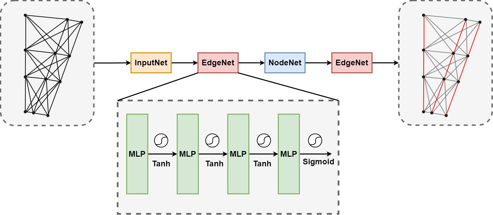

# TrackGNN: A Highly Parallelized and FIFO-Balanced Accelerator for the Particle-Track-Classification GNN on FPGAs
Welcome to the open-sourced repository for TrackGNN!
## Overview
This project focuses on developing a highly efficient accelerator to process collision data and solve **track reconstruction** tasks from high-energy physics experiments. Our accelerator is specifically tailored for **FPGA** platforms, with optimized, **FIFO-Balanced parallel processing** of graph data obtained from an actual particle detector, **sPHENIX Experiment at RHIC**.

### Background and Model Architecture
The TrackGNN accelerator implements two models with the same GNN architecture but different configurations. Each model processes input features of size 5 for each node, but they differ in embedding size and the number of layers. For the first model, the input network transforms the node embeddings to a dimension of 64, and the model has a total number of 4 layers. In the second optimized version, the node embedding size is reduced to 8 dimensions, and the model only requires 1 layer toto perform segmentation.





The above figure illustrated the architecture of the GNN model, which consists of three main network components: **InputNet**, **EdgeNet**, and **NodeNet**. The pixels in a particle detector are first grouped as hits and a graph is constructed on the hits. The model operates on graphs and alternates between EdgeNetwork and NodeNetwork layers to perform segment classification. The classification results can be further utilized by downstream track reconstruction tasks. Each component of the model is implemented as MLPs with tanh activations.

- **InputNetwork**: The input layer processes raw input features for each node (hit) in the graph, transforming them into a higher-dimensional node embedding.
- **EdgeNetwork**: The EdgeNetwork evaluates the connections between node embeddings, predicting whether a pair of hits is part of the same track or a spurious pair. It uses a sigmoid activation in the final layer to output a score for each edge, with scores closer to 1 indicating a valid track connection and scores closer to 0 suggesting a false connection. A threshold of 0.5 is typically applied to classify the edges.
- **NodeNetwork**: The NodeNetwork updates the embeddings of each node by aggregating information from its neighboring nodes and the edges connecting them. 

## FPGA Implementation
### Experiment Setup
All experiments are conducted on the **AMD Alveo U280 FPGA** using **Vitis v2022.1**, with a target frequency of 100MHz. The U280 FPGA is equipped with 4032 BRAM 18K blocks, 9024 DSP slices, 2.6M flip-flops, 1.3M LUTs, and 960 URAM blocks.

### Performance Metrics
The table below shows the latency results per graph for two GNN configurations at 100MHz.
| Model Configuration  | Node Embedding Dim | Number of Layers | Target Frequency | Measured Latency (ms) |
|----------------------|--------------------|------------------|------------------|-----------------------|
| **Model 1**          | 64                 | 4                | 100 MHz          | 150.2                 |
| **Model 2**          | 8                  | 1                | 100 MHz          | 30.5                  |

### How to Use
The two accelerators with different configurations can be found at `./TrackGNN/prj/dim_8_layer_1/` and `./TrackGNN/prj/dim_64_layer_4`, respectively. We have prepared the source codes and Makefile to deploy the accelerator on target U280 platform. To generate bitstream for the FPGA, follow these steps:

In the `config.h` file, uncomment  `#EMU` to enable emulation mode for hardware implementation and make the project.

```bash
make all
```

Once the bitstream is generated, program the FPGA and execute the host application:
```bash
./host_app ./path_to_your_xclbin_file
```
Alternatively, to run C Simulation, Synthesis or C-RTL Co-similation, you can uncomment `#SIM` and execute the `project.tcl` file as follows:
```bash
vitis_hls -f project.tcl
```
This will run the simulation and synthesis steps necessary for evaluating the design without full hardware implementation.

## References
This project is based on the novel algorithm proposed in [**Novel deep learning methods for track reconstruction**](https://arxiv.org/abs/1810.06111 ). The repository can be found at [**Trigger-Detection-Pipeline**](https://bitbucket.org/dtyu/trigger-detection-pipeline/src/main/). The specific part implemented in TrackGNN is `sPHENIX/tracking-GNN`. The architecture design of our accelerator is based on [**FlowGNN: A Dataflow Architecture for Real-Time Workload-Agnostic Graph Neural Network Inference**](https://ieeexplore.ieee.org/abstract/document/10071015), with improved sorting algorithm, quantization techniques and better FIFO balancing.

##Authors and Contact Information
This project is co-authored by:
-**Hanqing Zhang** (hanqing.zhang@zju.edu.cn)
-**Shuyang Li** (shuyanglee10008@gmail.com)
Under the guidance of **Prof. Cong Callie Hao** at Georgia Institute of Technology.

For any questions or issues related to this project, please feel free to reach out to Shuyang Li or Hanqing Zhang via e-mail. 
